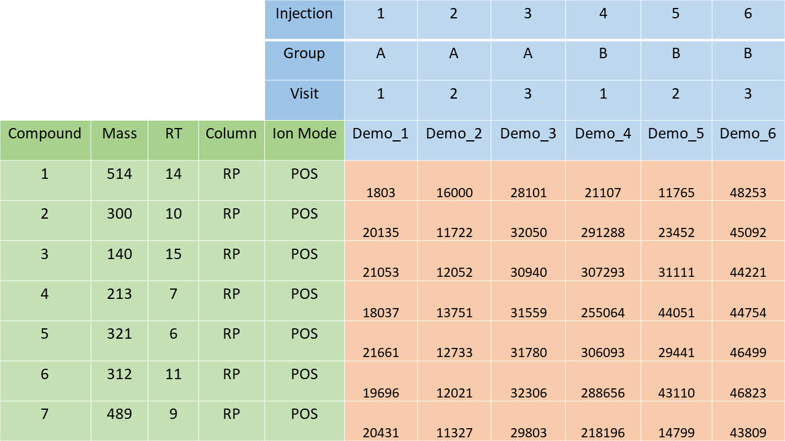

```{r setup, include = FALSE}
knitr::opts_chunk$set(
  collapse = TRUE,
  comment = "#>"
)
```

### MetaboSet utility vignette

This vignette provides an introduction to the ```MetaboSet``` class, along with a summary of many of the functions for accessing elements of ```MetaboSet``` objects and other utility functions.

#### Introduction to MetaboSets

```MetaboSet``` objects are the primary data structure of this package. ```MetaboSet``` is built upon the ```ExpressionSet``` class from the Biobase package by Bioconductor. ```ExpressionSet``` is used to record gene expression data, but the structure of the class is easily adaptable to LC-MS. For more information, read the [ExpressionSet documentation](https://www.bioconductor.org/packages/release/bioc/vignettes/Biobase/inst/doc/ExpressionSetIntroduction.pdf). ```MetaboSet``` objects consist of four main parts, each a matrix or a data frame:

- Information about the samples (phenotype) such as injection order, group label, time point etc. Accessible with ```pData(object)```
- Feature data: information about the features such as retention time and mass. Accessible with ```fData(object)```
- Abundances of features in each sample. Accessible with ```exprs(object)```
- Results from statistical analyses. Accessible with ```results(object)```

In addition to these, a ```MetaboSet``` can store the names of special columns in ```pData``` that store group labels, time points or subject identifiers. These columns are used as defaults in many of the functions of the package.  

- ```group_col``` holds the group column name  
- ```time_col``` holds the time point column name  
- ```subject_col``` holds the subject ID column name

Let's look at the four main parts in more detail:

##### Pheno data / Sample information

The sample information data frame, or ```pData``` has many special column names that are created when data is read from the Excel spreadsheet.  

- ```Sample_ID``` holds sample identifiers and must be present and can be automatically created. It is often used to label samples in visualizations, and as column names of ```exprs```. 
- ```Injection_order``` holds the injection order of samples and must be present. It is used in drift correction and commonly in some visualizations for quality control. 
- ```QC``` tells whether a sample is a QC sample ("QC") or a biological sample ("Sample"). This column can be created automatically, as long as there is any column (usually a group column) that has the value "QC" for QC samples and something else for the biological samples. This column is used by many quality control functions.

In addition to these three columns, pheno data often holds at least one of the group, time and subject ID columns that are defined separately. They are used as defaults by many functions for visualization and quality control.

##### Feature data

The feature data part usually has many columns that are created by the peak picking software, but for the sake of this package, the most important are:  

- Mass and retention time columns  
- Columns to identify the column and ionization mode to be used  
- ```Split```, which is used to separate different parts of the dataset, usually made by combining column and ionization mode  
- ```Feature_ID```, a unique identifier for each feature, made by combining Split, mass and retention time. ```Feature_ID``` is used as the row names of ```exprs``` and also present in ```results```


##### Abundances

Naturally, the abundance part, ```exprs```, is used by almost all the functions as it actually holds the data. Not much more to say here.

##### Results

Many functions use ```results``` data frame to record information such as quality metrics and results from statistical tests. One column of ```results``` is especially important: ```Flag``` column is used to flag features that are deemed low-quality for some reason (see ```?flag_detection``` and ```?flag_quality```). Many functions have an ```all_features``` that controls whether all features or only the good quality features should be used for the function. By default, ```all_features``` is always set to ```FALSE```, which means that all flagged features (features with a non-NA value in the ```Flag``` column) are ignored.

#### How to make MetaboSets?

##### Reading data from Excel spreadsheets

```{r, out.width = "600px", echo=FALSE}

```

To construct a ```MetaboSet``` object, you need to have the data read in R. This can be achieved with ```read_from_excel``` function, which reads Excel spreadsheets in the format shown in the figure above. The first parameters include the file name, sheet number, and coordinates for the corner ("Ion Mode" in the above example), in which the three parts of the dataset come together. The row must be numeric, but the column can be given either as a number or a letter (or a combination of two letters), as that is how it's displayed in Excel. 

Some fields in sample information and feature data have special purposes. 

There are a few obligatory fields:  

- "Injection_order" in sample information. The values must be numeric and unique  
- "Mass" or "Average mz" in feature data, not case sensitive  
- "Retention time", "RetentionTime", "Average rt(min)" or "rt"" in feature data, not case sensitive

Additionally, there are a few special cases:

- If sample information does not contain a "Sample_ID" field, one will be created. The sample IDs will be the injection order of the sample combined with a prefix, specified using the argument ```id_prefix```. The default prefix is "ID".  
- If sample information does not contain a "QC" field that separates between QC samples and regular samples, the function will attempt to automatically create one using one of the columns in sample information. The value will be "QC" for QC samples and "Sample" for regular samples. If the field is given, regular samples can have any value, but the value for QC samples should always be "QC".  
- One or more fields in feature data can be used to split the data into parts. These field names are given as the ```split_by``` parameter. Usually these columns are the LC column and Ionization mode. A new field "Split" will be added, that contains the combination of the columns given in the given order.  
ALTERNATIVELY, if the file only contains one mode, specify the name of the mode, e.g. "HILIC_pos" as the ```name``` argument. In this case, the "Split" field will equal "HILIC_pos" for all the features.

The function returns a list holding the three parts of the data:

- ```exprs```: feature abundances across the samples  
- ```pheno_data```: sample information  
- ```feature_data```: feature information

##### Construction of MetaboSet objects

```MetaboSet``` objects are constructed with the ```construct_MetaboSet``` function. The functions parameters include all the main parts of a ```MetaboSet``` object except ```results```, since a fresh object is initialized with a ```results``` data frame with only ```Feature_ID``` column and ```NA``` flag for each feature. The special column names can also be set for this function. Note that the function returns a named list of ```MetaboSet``` objects, where the feature data and abundances are split by the ```Split``` column in feature data (most commonly this means the four modes are returned separately). The sample information and special column names are identical for each object.

#### Inherited from ExpressionSet

These functions from Biobase might be useful:

- ```fData```: access feature data  
- ```pData```: access pheno data/sample information  
- ```exprs```: access feature abundances

In addition, MetaboSets can be subset using the syntax for ExpressionSets, namely:  

- Subsetting the ```exprs``` part holding the abundances can be done with simple square brackets. For example, ```example_set[1:5, 1:3]``` would get the first 5 features and the first 3 samples out of the ```example_set``` object.  
- Columns in ```pData``` can be accessed via a shortcut, for example ```example_set$Group```  
- So to get rid of a particular group, you can run ```example_set[, example_set$Group != "B""]```

#### MetaboSet-specific

Utility functions for MetaboSet in particular:

- ```group_col```, ```time_col``` and ```subject_col``` for the special column names  
- ```quality``` for the quality metrics of signals  
- ```combined_data``` for a data frame with sample information and feature abundances as columns (one row per smaple).  
- ```results``` access and set results  
- ```write_to_excel``` writes the whole object to an Excel spreadsheet

In addition, there are many functions that modify MetaboSets:

- ```mark_nas``` can be used to mark missing values as ```NA``` (peak picking software tend to report them as 0 or 1)
- ```mark_qcs``` marks QC samples in pData columns where they have NA values  
- ```drop_qcs``` removes the QC samples  
- ```drop_flagged``` removes all features that have been flagged (low-quality features)  
- ```merge_metabosets``` is used to merge MetaboSets from multiple modes together  
- ```join_fData``` can be used to merge a data frame to the ```fData``` part of an object  
- ```join_results``` merges data frames to the ```results``` part of an object. Useful for adding results from any statistical tests to the object.


