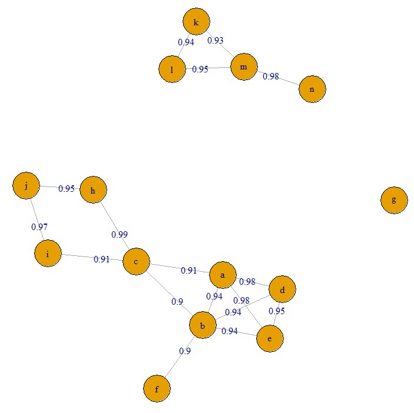
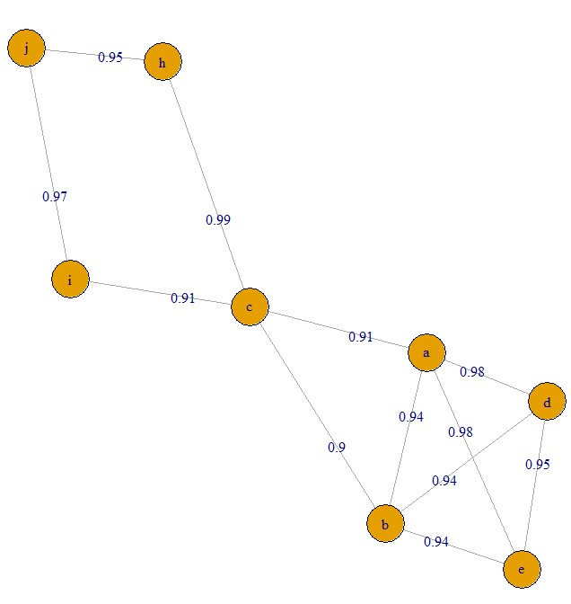
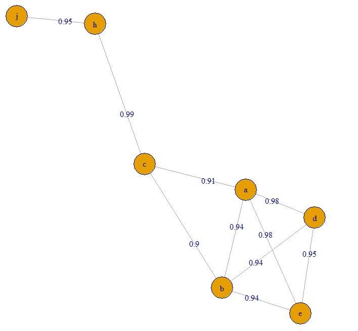
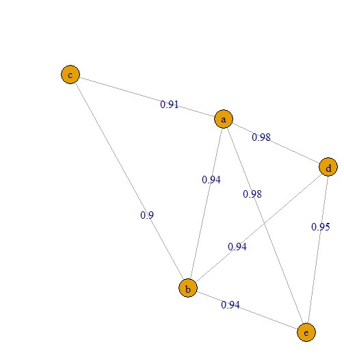
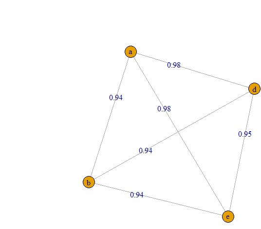
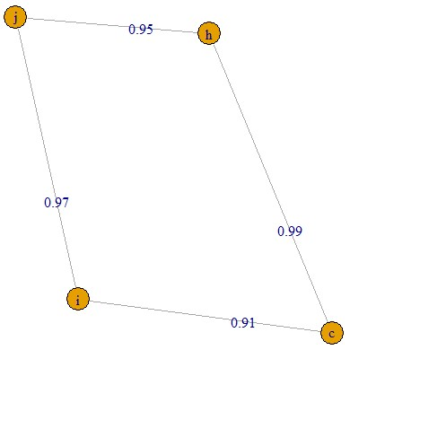
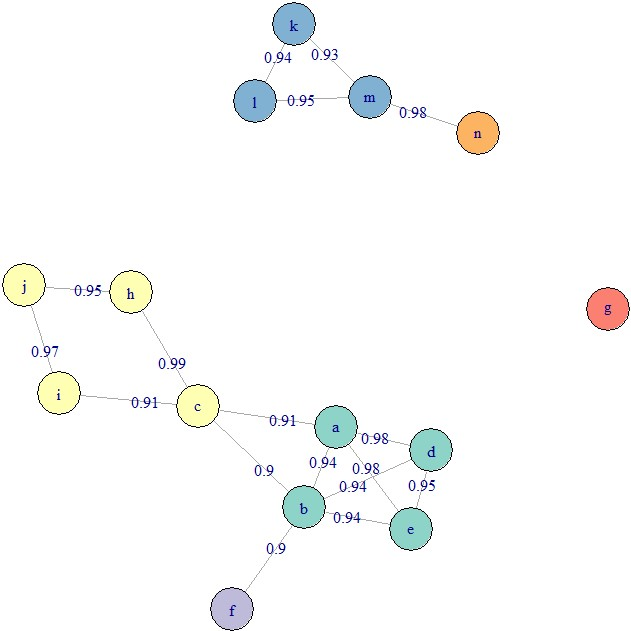

```{r setup, include = FALSE}
knitr::opts_chunk$set(
  collapse = TRUE,
  comment = "#>"
)
```


```{r, echo=FALSE, include=FALSE}
devtools::load_all()
```


## Feature clustering

This package implements an algorithm for clustering features originating from the same compound. Unlike many other steps in the package, this algorithm has an interface that is accessible without converting data to a MetaboSet object, as some users might only want to use these functions and ignore the rest of the package. This vignette provides a description of the underlying algorithm and instructions on how to apply clustering to MetaboSet object and data in individual data frames.

Note that you should run the algorithm separately for each mode in a dataset!


### Theoretical description of the algorithm

The procedures for identifying peaks originating from the same metabolite implemented in current software are not perfect but fail to detect some peaks originating from the same compound. This section presents an additional algorithm for detecting molecular features originating from the same compounds. The development of the algorithm was done in co-operation with David Broadhurst, Professor of Data Science & Biostatistics in the School of Science, and director of the Centre for Integrative Metabolomics & Computational Biology at the Edith Covan University.

Features originating from the same compound are assumed to be strongly correlated across samples and have a small difference in their retention time. This motivates the first step of the algorithm: the algorithm identifies pairs of correlated features within a specified retention time window. Both the correlation threshold and the size of the retention time window are specified by the user. For illustration, a correlation coefficient threshold of 0.9 and a retention time window of $\pm 1$ second is used. Pearson correlation coefficient is used, as the relationship between features originating from the same compound is assumed linear.

Next, an undirected graph of all the connections between features is generated, where each node represents a feature, each edge an aforementioned connection and edge weight the corresponding Pearson correlation coefficient, see the figure below for an example.

```{r, out.width = "400px", echo=FALSE, fig.align='center'}

```

\noindent The graph is then decomposed to its connected components, groups of nodes where all the nodes of the component are reachable from any other node. The components are then pruned, i.e. nodes are removed from the component until all the nodes have a sufficiently high degree (the number of edges of the node). This step requires a third user-defined parameter, degree threshold, defined as a percentage of the maximum possible degree. For example, in a component of five nodes, the maximum degree is 4. With a degree threshold of 0.8, each node is required to have at least $0.8 \cdot 4 = 3.2 \approx 3$ edges (the number of edges required is rounded to the nearest integer). If this criterion is not met, the node with the lowest degree is discarded until the criterion is met. In the case of a tie, the node with the lowest sum of edge weights is discarded. Note that nodes that are initially discarded can form new clusters among themselves, and single nodes can for a "cluster" of one node. The figures below illustrate the process of the algorithm on the largest component of the graph in the first figure, with degree threshold set to 0.8.

```{r, fig.show = "hold", out.width = "40%", fig.align = "default", echo = FALSE}

knitr::include_graphics("clust_1_1.jpg")



```

The first figure shows the original cluster. Clearly, node f will be dropped first. Next, nodes i, j and h all have degree 2. Since node i has the lowest sum of edge weights (correlations), it will get dropped.

```{r, fig.show = "hold", out.width = "40%", fig.align = "default", echo=FALSE}





```

Nodes j and h are the next nodes to be dropped. After that, the cluster still does not satisfy the condition, and node c will get dropped next, as it has the lowest degree.

```{r, fig.show = "hold", out.width = "40%", fig.align = "default", echo=FALSE}





```

Finally, each node is connected to all other nodes, so the cluster is finished. The dropped nodes will form another cluster, since the required threshold for the degree $0.8 \cdot 3 = 2.4 \approx 2$ is fulfilled for each node.

After the clustering, the feature with the largest median peak area is retained for each cluster. All the features that are clustered together are recorded for future reference. 


```{r, out.width = "400px", echo=FALSE, fig.align='center'}

```

The state of the example graph after clustering, with each final cluster colored differently. Degree threshold was set to 0.8.


### Interface for MetaboSet objects

For MetaboSet object, performing feature clustering is quite simple. All you have to do is call ```cluster_features```. The below example illustrates this on the toy dataset included in the package. Note that the values of the parameters are non-sensible! For real datasets, please use values close to the defaults. In addition, when performing the clustering on real life datasets, it is probably a good idea to use parallel processing to speed things up (to find the connections between features, the algorithm needs to go through all possible pairs of features).

To get visualizations of the clusters, set ```plotting = TRUE``` and specify a ```prefix``` for the file path. The function will create one file per cluster, with visualizations of the clusters.


```{r}
clustered <- cluster_features(example_set, rt_window = 2, corr_thresh = 0.4, d_thresh = 0.6)

```

This will add new columns to the ```results``` part of the object:

```{r}
colnames(results(clustered))
head(results(clustered)$Cluster_ID)
```

The ```Cluster_ID``` column shows the result of the clustering: the features in a cluster receive an ID "Cluster_x", where "x" is the name of the feature with the largest median peak area (MPA) in that cluster. If you only want to run the clustering to help you with identification of metabolites, this is enough. But if you want to compress the clusters, i.e. only keep one "feature" per cluster, you can do that by running:

```{r}
compressed <- compress_clusters(clustered)
```

This will only retain the main feature (the feature with highest MPA) for each cluster. This can help remove collinearity before any multivariate statistics.

### Interface without MetaboSet objects

The ```cluster_features``` function presented in the last section is actually only a wrapper around the functions that actually perform the clustering. For running the clustering without a MetaboSet object, you need two data frames:  

- ```data```: a data frame containing the abundances of features in each sample, one row per sample, each feature in a separate column  
- ```features```: a data frame containing information about the features, namely feature name (should be the same as the column name in ```data```), mass and retention time

The example below extracts these parts from the toy data example of this package:

```{r}
data <- combined_data(example_set)
features <- fData(example_set)
```

Next, we find all the connections between features by with ```find_connections```. We need to specify three columns names in ```features```: the columns containing feature names, masses and retention times. **NOTE:** as in the below example, the values for the parameters are chosen to be really weird, because this is random toy data. For real datasets, use values close to the defaults.

```{r}
conn <- find_connections(data = data, features = features,
                 corr_thresh = 0.4, rt_window = 2,
                 name_col = "Feature_ID", mz_col = "Mass", rt_col = "RetentionTime")
head(conn)
```

The output is a data frame with information about the connections: correlation coefficient plus mass and retention time differences.

The next step is to find and trim the clusters with ```find_clusters```:

```{r}
clusters <- find_clusters(connections = conn, d_thresh = 0.6)
```

The function iterates over the nodes multiple times, as the nodes discarded from clusters can form new clusters, as seen in the example in the theory part above. The number of components found is reported for each iteration.

After we have found the clusters, we can assign a cluster id to all features. Each cluster will be named after the feature with the highest median peak area.
```{r}
features_clustered <- assign_cluster_id(data, clusters, features, name_col = "Feature_ID")
```

As before, this will assign cluster ID to all features, and record which features belong to the same cluster. If you only want to use the clustering to help identification, you can stop here.

If you want to get visualizations of the clusters, run:

```{r, eval=FALSE}
visualize_clusters(data, features, clusters, min_size = 3, rt_window = 2,
                   name_col = "Feature_ID", mz_col = "Mass", rt_col = "RetentionTime",
                   file_path = "~/path/to/project/")
```


If you want to only keep one feature per cluster, you can do so by running:

```{r}
pulled <- pull_clusters(data, features_clustered, name_col = "Feature_ID")
cluster_data <- pulled$cdata
cluster_features <- pulled$cfeatures
```

Now, ```cluster_data``` only has one feature per cluster, and the features that are "inside" each cluster are still recorded in ```cluster_features```.
