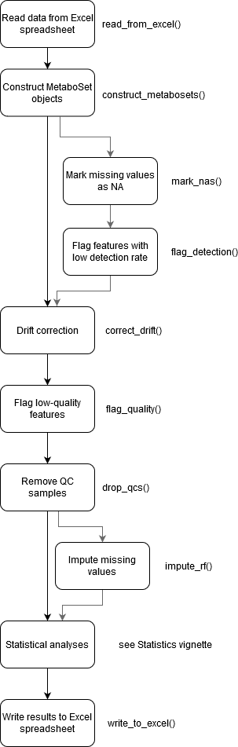

```{r setup, include = FALSE}
knitr::opts_chunk$set(
  collapse = TRUE,
  comment = "#>"
)
```

### General introduction: notame package

This vignette contains a general, high-level introduction that explains what notame is all about and what you can do with it.

#### Purpose

In a nutshell, notame was developed at the university of Eastern Finland with a goal to automate the data analysis of LC-MS metabolomics experiments. The starting point for the package is a peak table a.k.a. a peak list file, which is output from a peak picking software such as Agilent's MassHunter or MS-DIAL. The package takes these peak tables, reads them to R, conducts additional preprocessing and statistical analyses.

#### How does it work?

Basically everything in this package revolves around a class of objects called MetaboSet. These objects hold all the data and results from an LC-MS metabolomics experiment, and the functions in this package modify and visualize these objects. To learn more about MetaboSets, read the [MetaboSet utility vignette](MetaboSet.html).  

The general workflow of an analysis run with this package is shown in the diagram below. The diagram also includes the function names for each step.

```{r, out.heigth = "900px", echo=FALSE}

```

For a real code example of how to run a project, see the [Project example vignette](project_example.html). We like to run a set of visualizations between all the major steps of preprocessing to ensure good data quality. For a list of all the visualizations available, read the [Visualizations vignette](visualizations.html). For information about the novel algorithm for clustering molecular features originating from the same compound see [Feature clustering vignette](feature_clustering.html). Finally, the [Statistics vignette](statistics.html) lists all the statistical analyses that currently have an interface for MetaboSet objects.


#### Authors & Acknowledgements

The notame package is inspired by analysis scripts written by Jussi Paananen, Oskari Timonen and Anton Kl?vus (formerly Mattsson) at University of Eastern Finland. The algorithm for clustering molecular features originating from the same compound is based on MATLAB code written by David Broadhurst, Professor of Data Science & Biostatistics in the School of Science, and director of the Centre for Integrative Metabolomics & Computational Biology at the Edith Covan University. The package itself is written by Anton Klåvus for his master's thesis in Bioinformatics at Aalto university (published under former name Anton Mattsson). 

If you find any bugs or other things to fix, please submit an issue on GitHub! All contributions to the package are always welcome!

