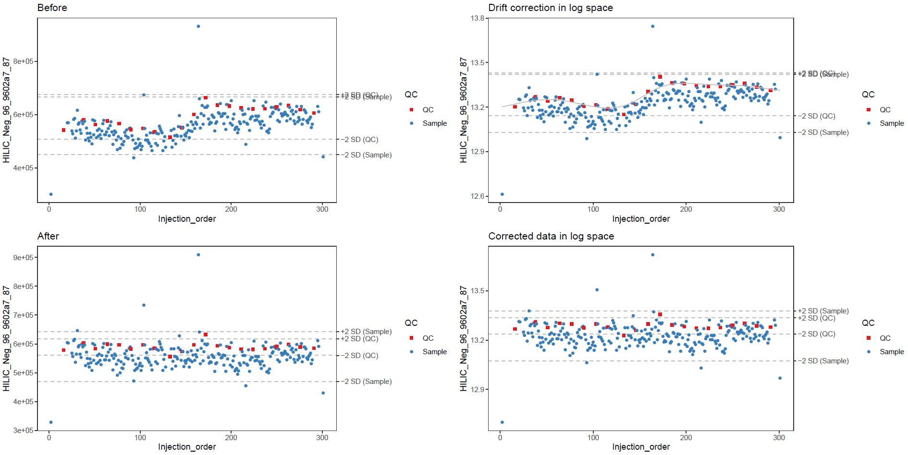
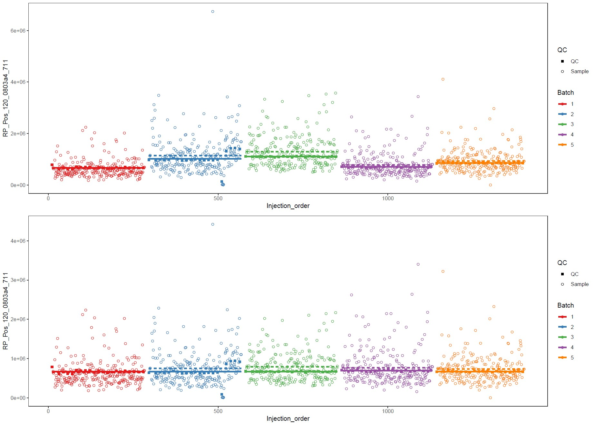

  
```{r setup, include = FALSE}
knitr::opts_chunk$set(
  collapse = TRUE,
  comment = "#>"
)
```


This vignette provides an overview of the preprocessing tools available for data in MetaboSet objects. Every section describes a problem and our solution to solving it and provides the corresponding function(s) of the package.

## Mark missing values correctly

Some data extraction ("peak picking") software marks missing values with a numeric value, such as 0, -1 or 999. In R, missing values are represented by a special value ```NA```. As a first step in data preprocessing, missing values should be correctly represented.

### Code

```mark_nas``` replaces given values in ```exprs``` part of the MetaboSet object with ```NA```.

## Drift correction 

Untargeted LC-MS metabolomics data usually suffers from signal intensity drift, i.e. systematic variation in the signal intensity as a function of injection order. Features of a dataset often have very different drift patterns. This means that to correct for the drift, we need a tool that can adapt to different drift patterns.

Most drift correction methods follow a simple logic:  
1. Model the systematic drift using QC samples.  
2. Correct the abundances of all the samples by reversing the modeled effect of the drift.

The approach used in this package models the drift separately for each feature, using cubic spline regression. The R function \code{smooth.spline} performs the modelling. The function only needs one hyperparameter, a so-called smoothing parameter. The smoothing parameter controls the "wiggliness" of the function: the larger the smoothing parameter, the closer the spline is to a linear function. By default, the smoothing parameter is chosen automatically using cross validation, and can vary between 0.5 and 1.5, where 1.5 is large enough to guarantee that the curve is practically linear. This interval seems to work well in practice.

We run the drift correction on log-transformed data. Log-transformed data follows the assumptions of the drift function model better, and avoids some practical issues. The corrected feature abundance for a sample with injection order $i$ is then computed using the following formula:
$$x_{corrected}(i) = x_{original}(i) + \overline{x}_{QC} - f_{drift}(i)$$

The below figure illustrates the procedure. 




The plots on the left show the feature abundances before and after the drift correction procedure. The plots on the right show the drift correction procedure in log-transformed space. The horizontal lines show deviations of +- 2 SD from the mean for QCs and biological samples. Note how the cubic spline can fit nonlinear drift patterns quite nicely.


### Code

To run drift correction on your data, use the function ```correct_drift```. It will allow you to run drift correction, adjust parameters of the cubic spline regression and optionally plot figures such as the above for your features.


## Flagging low quality compounds

LC-MS metabolomics datasets contain a significant number of low-quality features. We use certain quality metrics to flag those features. Flagged features are not removed from the data, but the flag information is stored on the "Flag" column of the fData part of the MetaboSet object. But if the features are not removed, then what difference does it make if they are flagged or not? Well, a rule of thumb about the role of flagged features is as followed: whenever you do operations that only deal with one feature at a time, flagged features are processed just like any other feature. Drift correction and log transformation are good examples of such procedure. But when you are running operations that involve multiple features at a time, such as random forest imputation, PCA visualization or any multivariate statistical models, the flagged features are silently ignored. For feature-wise statistics, the statistical model is fit for flagged features, but FDR correction is only done for non-flagged features. Most functions in the package have an argument called all_features, which is FALSE by default, and can be set to TRUE to force the function to treat all features as equal (ignore flags).

The primary function of the QC samples is to allow us to (surprise) assess the quality of the molecular features. The variation in the feature abundance of QC samples should be small. But how do we define "small"? Luckily, this question is answered in the paper by Broadhurst et.al., which provides us with five useful quality metrics.

### Detection rate

First, we look at QC detection rate. This can be defined as simply the number of detected QC samples divided by the number of expected QC samples for a given metabolite, expressed as a percentage. If a signal can't be reliably detected in QC samples, it is regarded as noise. The paper suggests an acceptance limit of 70%, but this seems quite harsh for studies where the groups differ significantly. In these cases, some group might have metabolites that are not present in others, which means that their concentration in the QC samples might fall below the resolution of the mass spectrometer. 

Additionally, it is sometimes useful to flag features that

### Spread of the QCs
The actual quality metrics measure two things: internal spread of the QCs and spread of the QCs compared to the spread of the biological samples. 

Internal spread is measured with relative standard deviation (RSD), also known as coefficient of variation (CV).  

$$ RSD = \frac{s_{QC}}{\bar{x}_{QC}} $$

Where $s_{QC}$ is the standard deviation of the QC samples and $\bar{x}_{QC}$ is the sample mean of the signal in the QC samples. RSD can also be replaced by a non-parametric, robust version based on the median and median absolute deviation (MAD):

$$RSD^* = \frac{1.4826 \cdot MAD_{QC}}{\text{median}(x_{QC}}$$

We are using the robust version as it is less affected by a single outlying QC and since the original RSD works best if the data is normally distributed, which is often not the case with our data.

The spread of the QC samples compared to the biological samples is measured using a metric called D-ratio:

$$D-ratio = \frac{s_{QC}}{s_{biological}}$$

Or, as before, a non-parametric, robust alternative:

$$D-ratio* = \frac{MAD_{QC}}{MAD_{biological}}$$

We are using the robust alternative of D-ratio as well, for the same reasons as above.

### Limits used in filtering

The recommended limits for RSD and D-ratio are 0.2 and 0.4, respectively. So the signals need to score lower than the limits in both metrics to survive filtering. Since we are using the robust alternatives, we have added an additional condition:  Signals with classic RSD, RSD\* and basic D-ratio all below 0.1 are kept. This additional condition prevents the removal of signals with very low values in all but a few samples. These signals tend to have a very high value of D-ratio\*, since the median absolute deviation of the biological samples is not affected by the large concentration in a handful of samples, causing the D-ratio* to overestimate the significance of random errors in measurements of QC samples. Thus, other quality metrics are applied, with a conservative limit of 0.1 to ensure that only good quality signals are kept this way.

### Use in overall quality assessment
The distribution of the quality metrics across signals can be used as a good quality metric of a study. In the future, some key statistics, for example the mean, median and maybe some other quantiles could be reported for each statistic. This would yield us a nice way of quantifying the quality of the data from any given experiment.


### Code

```flag_detection``` is used to flag features based on detection
```flag_quality``` is used to flag features based on the other quality metrics


## Imputation of missing values

LC-MS data often contain missing values. Since many of the common statistical analysis methods require complete data matrices, we need to impute the missing values. Imputing means "filling" the missing values with a good estimate. Note that even if some statistical methods state that they "can deal with missing values", they sometimes just ignore samples or variables with at least one missing value, or impute the missing values before applying the actual method. 

### Random forest imputation

Note that there are many different imputation strategies out there. We have tested a bunch of them on our data (the paper on that will be published soon) and we concluded that random forest imputation works best for our data. To be brief, the method predicts the missing part of the data by fitting a random forest on the observed part of the data (read more in the [original paper](https://doi.org/10.1093/bioinformatics/btr597) and the [missForest package introduction](https://stat.ethz.ch/education/semesters/ss2012/ams/paper/missForest_1.2.pdf).

It is important to set the seed number before using random forest imputation, to guarantee reproducibility of the results. The downside of random forest imputation is that it is rather slow. Thus, we recommend running the imputation separately for each analysis mode if the dataset has more than 100 samples, or if there are lots of missing values. Note that the implementation we use (from the missForest package) can be parallelized, but be aware: running the imputation in parallel prevents you from setting the seed number, as currently there seems to be no way of setting the seed number for the child processes.

### Simple imputation strategies

If you don't want to use random forest imputation, there are other simpler alternatives implemented in this package, where every missing value in a feature is imputed using a similar value, independent of the values of other features for the sample. Most of these strategies rely on the assumption that missingness is mostly caused by the fact that the metabolite concentration is below the detection limit. These imputation strategies include:

- constant imputation: each missing value in all features is imputed with e.g. 0 or 1  
- imputation by mean/median/min/half min: impute missing values of a feature with the mean/median/minimum/half the minimum of the observed values of that feature  
- imputation by a small random value: impute missing values of a feature with random numbers between zero and the minimum of the observed values (sampling from a uniform distribution).

### Code

- ```impute_rf``` for random forest imputation  
- ```impute_simple``` for the simple imputation strategies


## Batch effect correction

In experiments with high numbers of samples, all samples do not fit in a single run. Running the samples on multiple occasions inevitably leads to batch effects. notame includes multiple solutions to deal with batch effects. All are available in other packages, notame provides wrappers for use with MetaboSet objects. Details of the algorithms are not provided here, but below is a table of the methods with links to original publications:

| Method                                                                     | notame function   | paper     | package                     |
|----------------------------------------------------------------------------|-------------------|-----------|-----------------------------|
| Mean/median difference of QCs/all samples based on feature reproducibility | normalize_batches | [link](https://doi.org/10.1007/s11306-016-1124-4) | [batchCorr](https://gitlab.com/CarlBrunius/batchCorr/)                     |
| Linear models with multiple tweaking options                               | dobc              | [link](https://doi.org/10.1007/s11306-016-1015-8) | [BatchCorrMetabolomics](https://github.com/rwehrens/BatchCorrMetabolomics) |
| Removal of Unwanted variation - originally for RNA-seq data                | ruvs_qc           | [link](https://doi.org/10.1038/nbt.2931)          | [RUVSeq](https://bioconductor.org/packages/release/bioc/html/RUVSeq.html)  |


### Evaluating batch effect correction

To evaluate the performance of different batch effect correction methods on your data, you can use the same metrics as Wehrens et al. used when developing the [BatchCorrMetabolomics](https://github.com/rwehrens/BatchCorrMetabolomics) package (read more from their [paper](https://doi.org/10.1007/s11306-016-1015-8)). notame provides these metrics in the following functions:

- ```pca_bhattacharyya_dist``` Bhattacharyya distance between batches in PCA space
- ```perform_repeatability``` for repeatability of individual features

We have only worked with one multi-batch experiment so far, so our results are far from conclusive, but the methods from ```normalize_batches``` and ```dobc``` seem to work best for us.

You should also visually inspect the results with PCA and t-SNE plots (```plot_pca``` and ```plot_tsne```) with samples colored by batch. To view the effect on individual features, use ```save_batch_plots``` for figures as the one below, showing the levels of a feature before and after batch correction. The full lines represent grand means of batches and the dashed lines QC means of batches.




